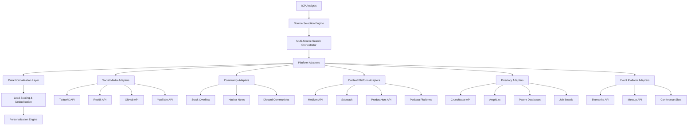

# Enhanced Lead Generation System Design

## Overview

This design extends the existing lead generation agent with a multi-source prospecting system that intelligently selects and queries diverse platforms based on ICP analysis. The system maintains the current Google search + LinkedIn parsing foundation while adding 15+ new lead sources across social media, professional communities, content platforms, business directories, and event platforms.

## Architecture

### Core Components



### Integration with Existing System

The enhanced system extends the current workflow by:

1. **Replacing the strategy selection node** with an intelligent source selection engine
2. **Adding platform-specific search nodes** that run in parallel
3. **Enhancing the parsing layer** to handle diverse data formats
4. **Upgrading the deduplication system** to merge multi-source profiles

## Components and Interfaces

### 1. Source Selection Engine

**Purpose**: Automatically determines optimal lead sources based on ICP analysis

**Interface**:
```python
class SourceSelectionEngine:
    def analyze_icp_for_sources(self, icp: Dict) -> List[SourceConfig]:
        """Analyzes ICP and returns prioritized list of sources to use"""
        
    def get_source_strategies(self, sources: List[str]) -> Dict[str, SearchStrategy]:
        """Returns platform-specific search strategies"""
```

**Logic**:
- **B2B SaaS**: Prioritize LinkedIn, Twitter, ProductHunt, Crunchbase, tech conferences
- **E-commerce**: Focus on Instagram, TikTok, YouTube, Shopify communities, retail events
- **Developer Tools**: Emphasize GitHub, Stack Overflow, Hacker News, dev conferences
- **Healthcare**: Target medical forums, LinkedIn, healthcare events, research publications
- **Finance**: Focus on financial forums, LinkedIn, fintech events, regulatory databases

### 2. Platform Adapters

Each platform adapter implements a common interface while handling platform-specific authentication, rate limiting, and data extraction.

**Base Interface**:
```python
class PlatformAdapter:
    def authenticate(self) -> bool:
        """Handle platform authentication"""
        
    def search(self, query: str, filters: Dict) -> List[RawResult]:
        """Execute search with platform-specific parameters"""
        
    def extract_prospects(self, results: List[RawResult]) -> List[Prospect]:
        """Convert platform results to standardized prospect format"""
        
    def get_rate_limits(self) -> RateLimitInfo:
        """Return current rate limit status"""
```

#### 2.1 Social Media Adapters

**Twitter/X Adapter**:
- Uses Twitter API v2 for search and user data
- Searches by keywords, hashtags, and user engagement
- Extracts profiles from tweet authors and active commenters
- Handles rate limiting (300 requests per 15-minute window)

**Reddit Adapter**:
- Uses PRAW (Python Reddit API Wrapper)
- Searches relevant subreddits for active contributors
- Extracts user profiles and engagement patterns
- Focuses on professional and industry-specific subreddits

**GitHub Adapter**:
- Uses GitHub REST API
- Searches repositories, contributors, and organizations
- Extracts developer profiles and project involvement
- Identifies decision-makers in relevant tech companies

**YouTube Adapter**:
- Uses YouTube Data API v3
- Searches channels and video comments in relevant niches
- Extracts channel owners and active commenters
- Focuses on business and educational content

#### 2.2 Community Adapters

**Stack Overflow Adapter**:
- Uses Stack Exchange API
- Searches by tags and user activity
- Extracts high-reputation users and active contributors
- Identifies technical decision-makers

**Hacker News Adapter**:
- Uses unofficial HN API
- Searches posts and comments for relevant discussions
- Extracts active contributors and startup founders
- Focuses on tech and startup communities

**Discord Adapter**:
- Uses Discord API (where permitted)
- Searches public servers and channels
- Extracts active community members
- Focuses on professional and industry communities

#### 2.3 Content Platform Adapters

**Medium Adapter**:
- Uses Medium API
- Searches articles and author profiles
- Extracts thought leaders and active writers
- Focuses on business and industry content

**ProductHunt Adapter**:
- Uses ProductHunt API
- Searches makers, hunters, and commenters
- Extracts startup founders and early adopters
- Focuses on tech and innovation communities

**Podcast Adapter**:
- Uses podcast directory APIs (Apple Podcasts, Spotify)
- Searches hosts, guests, and show descriptions
- Extracts industry experts and thought leaders
- Focuses on business and professional podcasts

#### 2.4 Directory Adapters

**Crunchbase Adapter**:
- Uses Crunchbase API
- Searches companies, founders, and investors
- Extracts funding information and growth indicators
- Focuses on startups and growth companies

**AngelList Adapter**:
- Uses AngelList API
- Searches startups and talent profiles
- Extracts founders and early employees
- Focuses on startup ecosystem

**Job Board Adapter**:
- Scrapes major job boards (LinkedIn Jobs, Indeed, etc.)
- Identifies companies actively hiring
- Extracts hiring managers and HR contacts
- Focuses on growth indicators

#### 2.5 Event Platform Adapters

**Eventbrite Adapter**:
- Uses Eventbrite API
- Searches events and attendee information
- Extracts organizers and speakers
- Focuses on professional and industry events

**Meetup Adapter**:
- Uses Meetup API
- Searches groups and member profiles
- Extracts organizers and active members
- Focuses on professional networking groups

### 3. Data Normalization Layer

**Purpose**: Converts diverse platform data into standardized prospect format

**Standardized Prospect Schema**:
```python
@dataclass
class Prospect:
    name: str
    title: Optional[str]
    company: Optional[str]
    email: Optional[str]
    linkedin_url: Optional[str]
    twitter_url: Optional[str]
    github_url: Optional[str]
    website: Optional[str]
    bio: Optional[str]
    location: Optional[str]
    industry: Optional[str]
    source_platform: str
    source_url: str
    engagement_score: float
    relevance_score: float
    last_activity: Optional[datetime]
    additional_data: Dict[str, Any]
```

### 4. Lead Scoring & Deduplication Engine

**Scoring Algorithm**:
- **ICP Match Score** (40%): How well prospect matches ideal customer profile
- **Engagement Score** (25%): Activity level and engagement quality on platforms
- **Accessibility Score** (20%): Likelihood of successful outreach (contact info availability)
- **Buying Signals** (15%): Recent activity indicating potential need

**Deduplication Logic**:
- Primary matching on email, LinkedIn URL, or full name + company
- Secondary matching using fuzzy string matching on names
- Profile merging with confidence scores for each data point
- Source attribution tracking for all merged data

### 5. Enhanced Search Orchestrator

**Parallel Execution**:
- Executes searches across multiple platforms simultaneously
- Implements platform-specific rate limiting and retry logic
- Aggregates results in real-time as they complete
- Provides progress updates and partial results

**Query Generation**:
- Platform-specific query optimization
- Keyword expansion based on ICP analysis
- Boolean search logic for complex queries
- Geographic and demographic filtering

## Data Models

### Source Configuration
```python
@dataclass
class SourceConfig:
    platform: str
    priority: int  # 1-10, higher is more important
    max_results: int
    search_parameters: Dict[str, Any]
    rate_limit_delay: float
    enabled: bool
```

### Search Strategy
```python
@dataclass
class SearchStrategy:
    primary_queries: List[str]
    fallback_queries: List[str]
    filters: Dict[str, Any]
    result_limit: int
    quality_threshold: float
```

### Multi-Source Result
```python
@dataclass
class MultiSourceResult:
    prospects: List[Prospect]
    source_performance: Dict[str, SourceMetrics]
    total_execution_time: float
    successful_sources: List[str]
    failed_sources: List[str]
```

## Error Handling

### Platform-Specific Error Handling
- **Rate Limiting**: Exponential backoff with jitter
- **Authentication Failures**: Automatic token refresh where possible
- **API Downtime**: Graceful degradation to alternative sources
- **Data Quality Issues**: Validation and filtering of malformed data

### Fallback Strategies
- If primary sources fail, automatically switch to secondary sources
- Maintain minimum viable result set from at least 2 sources
- Log all failures for system monitoring and improvement

### Compliance and Ethics
- Respect robots.txt and platform terms of service
- Implement request delays and user-agent rotation
- Store only publicly available information
- Provide opt-out mechanisms for prospects

## Testing Strategy

### Unit Testing
- Individual platform adapter testing with mock APIs
- Data normalization and scoring algorithm validation
- Deduplication logic verification

### Integration Testing
- End-to-end workflow testing with real APIs (rate-limited)
- Cross-platform data consistency validation
- Performance testing under various load conditions

### A/B Testing Framework
- Compare multi-source vs single-source performance
- Test different source selection algorithms
- Measure conversion rates by source type

## Performance Considerations

### Caching Strategy
- Cache API responses for 1-24 hours depending on data freshness needs
- Implement Redis-based caching for prospect profiles
- Cache ICP-to-source mappings for similar queries

### Scalability
- Horizontal scaling through worker processes
- Queue-based job processing for large prospect lists
- Database sharding for prospect storage

### Monitoring
- Track API usage and rate limit consumption
- Monitor source performance and success rates
- Alert on unusual failure patterns or data quality issues